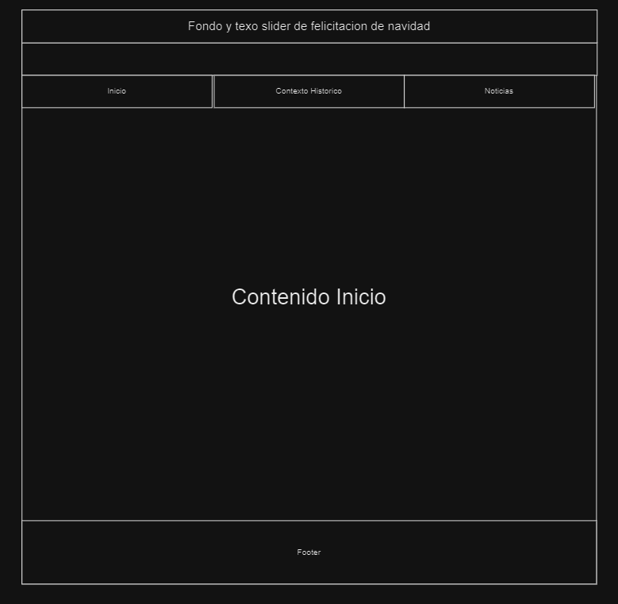
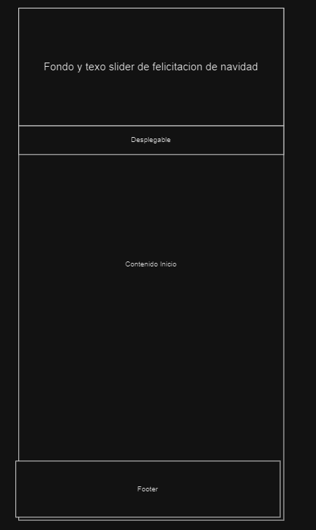
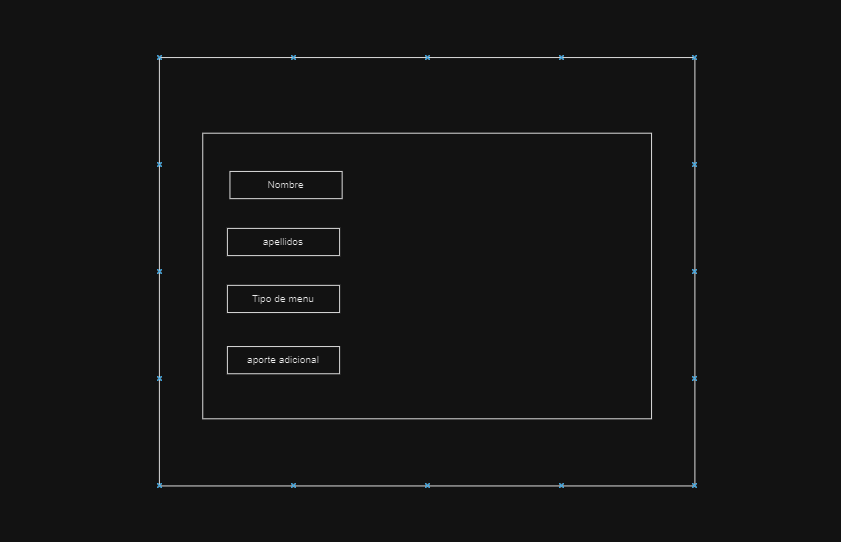

# Entrega 1º trimestre
# Navidad en calasanz

## Guía
- Introduccion
    - Que es la naviadad:
        La Navidad es una festividad cristiana que celebra el nacimiento de Jesús, observada el 25 de diciembre en gran parte del mundo. Aunque tiene raíces religiosas, también se ha convertido en una festividad cultural y familiar, marcada por tradiciones como la decoración del árbol de Navidad, el intercambio de regalos, las reuniones familiares y las comidas especiales.
    - Por que la navidad en el Calasanz
        Celebramos la navidad en el calasanz dado que es una festividad religiosa y el calasanz es una institucion religiosa, ademas se celebra para inculcar los valores de la navidad como la solidaridad, generosisdady la unidad.
    - ...
- Estructura de la pagina
    - Responsive (Dos niveles)
    
    
    - Una pagina con formulario
    
    - Menu ha de incluir
        - Inicio
        Breve resumen sobre la organizacion de el calasanz en eventos navideños y actividades que se realizaran.
        - Contexto Historico
        Breve resumen sobre el contexto historico de la navidad desde el punto de vista religiosos
        - Noticias
        Noticias sobre la nacidad y sobre las actividades que se realizaran en el calasan
    - Footer
- Logo
    Logo original e calasanz con gorro de navidad
- Colores
    Rojo, verde, blanco y azul
- Fuentes: Mountaisn of Christmas